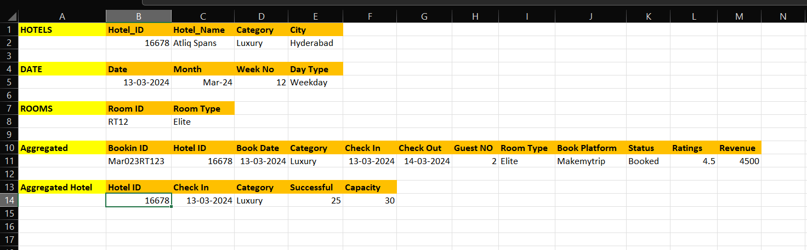
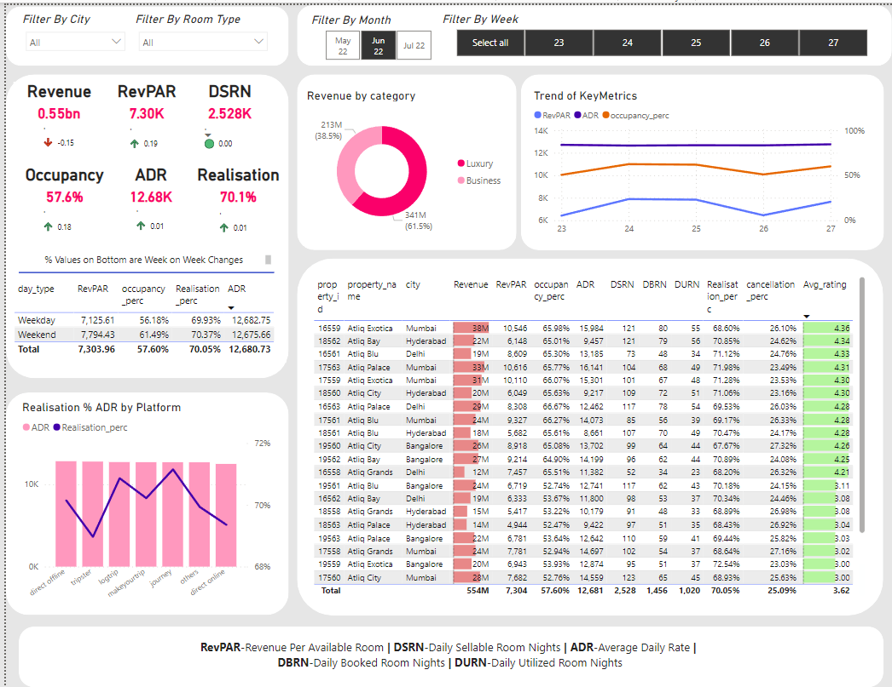

Problem Statement :
AtliQ Grands owns multiple five-star hotels across India. They have been in the hospitality industry for the past 20 years.
Due to strategic moves from other competitors and ineffective decision-making in management, AtliQ Grands are losing its market share and revenue in the luxury/business hotels category.
As a strategic move, the managing director of AtliQ Grands wanted to incorporate “Business and Data Intelligence” to regain their market share and revenue.However, they do not have an in-house data analytics team to provide them with these insights.

Solution :
--> Required understanding of problem statement and understand required key metrics 
Collect data from Clients in various sources and in different file formats(sql,Excel,CSV) 
The data consists of different tables 

  We need to load that data into Power BI 
[Data Files](Data)
 
-->Next process is Data Cleaning and Data Modelling Using Dax 
we need to establish relationship with different tables using Star Schema. 
Using DAX Formulas we create measures for our requirements 

 
-->Create charts for insights using Power BI Dashboard features. 
[Dashboard Insights](hotelsPBI.pbix)
 

