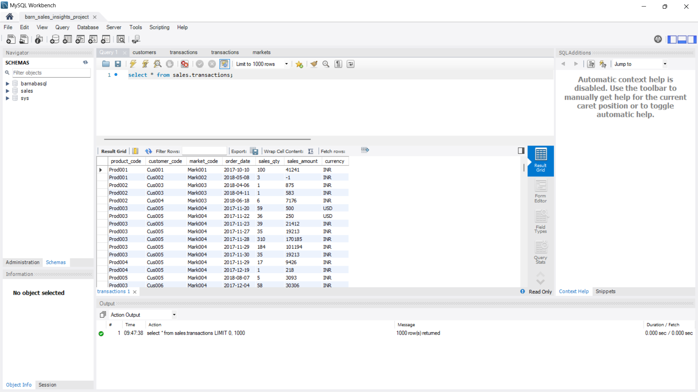
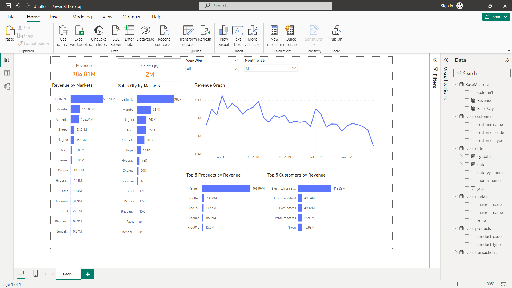

Problem Statement : Atliq Hardware is the Company which supplies Computer Hardware to many small stores across India. Adam Adams is the Sales Director of Company. He is facing challenges in tracking the sales data of company. The company is loosing its market by decrease in sales recently. So, he wants the insights of sales on various parameters. To do that,the data need to be arranged properly.To generate insights about sales,the data need to be presented in Charts and Dashboards.

Solution : The data Consists of different tables

All this data is stored in Sql Servers.We need to load that data into Power BI

After that 
•	Clean the Data 
•	Arrange the Data 
•	Create relationship between all the tables 
•	Create charts for insights using Power BI Dashboard features. 

