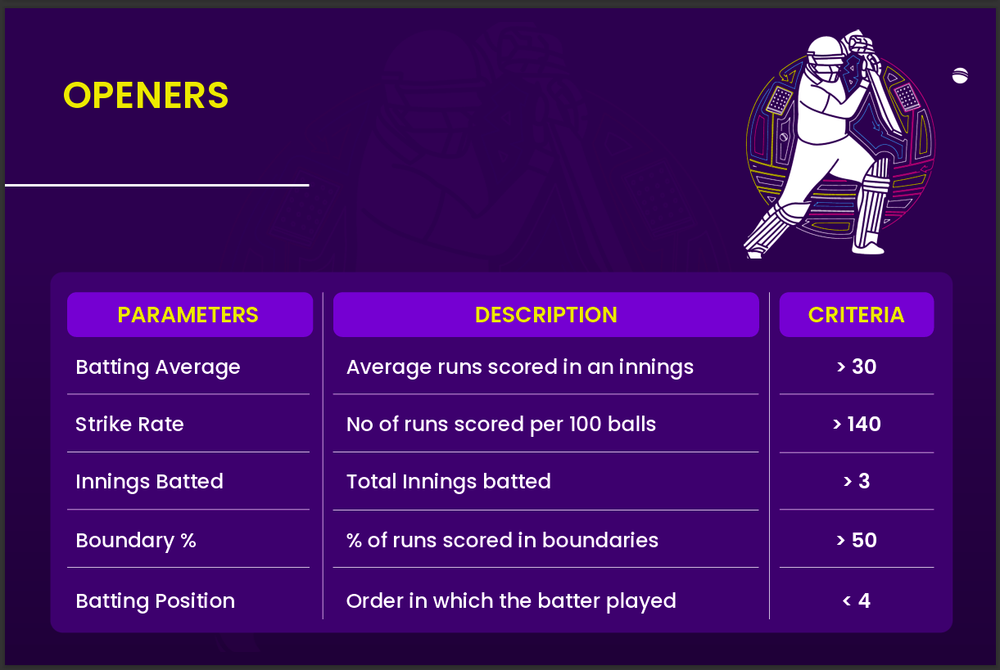

Problem Statement : 
Create Best Playing 11 to Defeat the Team of Planet Sparta

Requirements for team of Playing 11 :

1)The team should be able to score at least 180 runs on an average 
2)They should be able to defend 150 runs on an average 
and also selectors has given some criteria for differnt roles of Playing XI

 

Solution :
Collection of Data from Espn website in Json file format using web scraping

Data cleaning with python using pandas library

(sometimes taken the help from chat GPT to write syntax for some operations )

And after cleaning the json files export them into csv files

The data Contains various tables  
Transform that data according to your requirements using Power Query

-->Next process is Data Cleaning and Data Modelling Using Dax 
we need to establish relationship with different tables using Star Schema. 
Using DAX Formulas we create measures for our requirements 

3)dashboarding and insights generation
Create new measures for key metrics
Build dashboard and select best playing 11

